# Test Execution Guide — ActionFlows Dashboard

> Visual workflows, decision trees, and quick reference for navigating the ActionFlows test ecosystem.

## Table of Contents

- [Overview](#overview)
- [Test Types at a Glance](#test-types-at-a-glance)
- [Execution Workflow](#execution-workflow)
- [Troubleshooting Decision Tree](#troubleshooting-decision-tree)
- [Test Reports Navigation](#test-reports-navigation)
- [Best Practices](#best-practices)
- [Quick Commands Reference](#quick-commands-reference)
- [Test Structure](#test-structure)

---

## Overview

The ActionFlows Dashboard uses a **three-tier testing strategy** to ensure code quality, integration health, and orchestrator harmony:

| Tier | Tool | Purpose | Speed | Coverage | When to Run |
|------|------|---------|-------|----------|------------|
| **Unit** | Vitest | Test functions, hooks, utilities in isolation | Fast (< 5s) | 60-70% | During development, every commit |
| **Integration** | Vitest | Test service layers, APIs, storage interactions | Medium (10-30s) | 50-70% | Before PRs, feature completion |
| **E2E** | Playwright | Test complete user workflows in browser | Slow (2-5m) | 30-40% | Before deployment, release |
| **Contract** | Custom validator | Validate orchestrator output harmony | Fast (< 2s) | N/A | After orchestrator changes |
| **Performance** | Vitest Bench | Baseline latency and throughput | Fast (5s) | N/A | Before major releases |

### Testing Philosophy

- **Unit tests** catch logic bugs early — write first, run constantly
- **Integration tests** catch API contract violations — run before merging
- **E2E tests** catch user flow breaks — run before deployment
- **Contract tests** ensure orchestrator-dashboard harmony — run after code changes
- **Performance tests** prevent regression — run before releases

---

## Test Types at a Glance

### Unit Tests (Vitest)

Tests individual functions, components, and utilities in isolation.

```bash
# Run all unit tests
pnpm test

# Run specific package
pnpm -F @afw/backend test
pnpm -F @afw/app test

# Watch mode (auto-rerun on changes)
pnpm test -- --watch

# Run with coverage
pnpm test -- --coverage

# Run single file
pnpm test -- sessions.test.ts

# Run tests matching pattern
pnpm test -- --grep "Session creation"
```

**Where to find tests:**
- Backend: `packages/backend/src/__tests__/`
- Frontend: `packages/app/src/__tests__/`

---

### Integration Tests (Vitest)

Tests service APIs, storage layers, and component interactions.

```bash
# Run all integration tests
pnpm -F @afw/backend test -- integration

# Run specific integration suite
pnpm test -- --grep "WebSocket" integration

# Watch mode
pnpm test -- --watch integration
```

**Where to find tests:**
- `packages/backend/src/__tests__/integration/`

---

### E2E Tests (Playwright)

Tests complete user workflows from browser UI to backend API.

```bash
# Run all E2E tests (headless)
pnpm test:pw

# Run tests with interactive UI
pnpm test:pw:ui

# Run tests in headed mode (see browser)
pnpm test:pw:headed

# View test report
pnpm test:pw:report

# Run specific test file
pnpm test:pw -- sessions.spec.ts

# Run tests matching pattern
pnpm test:pw -- --grep "Session creation"
```

**Where to find tests:**
- `test/e2e/*.spec.ts`
- `test/playwright/` — Config and fixtures

---

### Contract Validation

Validates backend output matches the contract specification for orchestrator compatibility.

```bash
# Validate all contracts
pnpm contracts:validate

# Check backend harmony
pnpm -F @afw/backend test -- contracts
```

**What gets validated:**
- Orchestrator output format (status, fields, structure)
- Response schemas (sessions, chains, events)
- Required properties and types

---

### Performance Benchmarks

Measures system throughput and latency across key operations.

```bash
# Run all benchmarks
pnpm -F @afw/backend vitest bench --run

# Run specific benchmark
pnpm -F @afw/backend vitest bench --run performance.bench.ts

# Watch benchmark results
pnpm -F @afw/backend vitest bench
```

**Benchmarks measure:**
- Session creation throughput (> 500 ops/sec)
- Event ingestion latency (< 10ms p95)
- Chain compilation (< 1ms p99)
- Storage read/write performance
- WebSocket broadcast simulation
- Mixed workload (real-world scenario)

---

## Execution Workflow

### Visual Workflow Diagram


---

### Daily Testing Pattern

**When developing a feature:**

1. **Write unit test** (test-first)
   ```bash
   pnpm test -- --watch
   ```
   Leave running in terminal, edit code until test passes

2. **Write component/service** (make test pass)
   ```typescript
   // Test runs automatically in watch mode
   // You see red → green transition
   ```

3. **Add integration test** (optional, for APIs)
   ```bash
   pnpm test -- integration --watch
   ```

4. **Write E2E test** (user flow verification)
   ```bash
   pnpm test:pw:ui
   # Interactive UI for building test step-by-step
   ```

5. **Validate contract** (before commit)
   ```bash
   pnpm contracts:validate
   ```
   Ensure orchestrator output format is correct

6. **Run full suite** (before pushing)
   ```bash
   pnpm test
   pnpm test:pw
   pnpm contracts:validate
   ```

---

### Pre-commit Testing Checklist

Run this before pushing to a branch:

```bash
# 1. Type check
pnpm type-check

# 2. Lint
pnpm lint

# 3. Unit tests
pnpm test

# 4. Integration tests
pnpm -F @afw/backend test -- integration

# 5. Contract validation
pnpm contracts:validate

# 6. E2E tests (if UI changed)
pnpm test:pw
```

Or use pre-commit hooks (automatic):

```bash
pnpm setup:hooks
# Now tests run automatically before commit
```

---

### Feature Completion Testing

When a feature is code-complete:

```bash
# 1. Run all tests (fast path)
pnpm test
pnpm -F @afw/backend test -- integration

# 2. Run E2E suite
pnpm test:pw

# 3. Validate contracts
pnpm contracts:validate

# 4. Check performance
pnpm -F @afw/backend vitest bench --run

# 5. Generate coverage report
pnpm test -- --coverage

# 6. Review coverage gaps
# Open coverage/index.html in browser
```

---

### Pre-release Testing

Before deploying to production:

```bash
# 1. Full test suite
pnpm test
pnpm test:pw
pnpm contracts:validate

# 2. Performance validation
pnpm -F @afw/backend vitest bench --run

# 3. Health check
pnpm health:check

# 4. Build
pnpm build

# 5. Review performance baseline
# See PERFORMANCE_BASELINE.md for expected metrics
```

---

## Troubleshooting Decision Tree

### Visual Decision Tree

```mermaid
flowchart TD
    Fail["Test Failed"] --> ErrorQ{What is the error?}

    ErrorQ -->|"Timeout"| TimeoutPath["Test took > timeout<br/>Increase timeout or fix async"]
    ErrorQ -->|"Module not found"| ModulePath["Import/require path broken<br/>Check imports & aliases"]
    ErrorQ -->|"Assertion failed"| AssertPath["Logic error<br/>Review test expectation"]
    ErrorQ -->|"Element not found"| ElementPath["DOM element missing<br/>E2E selector issue"]
    ErrorQ -->|"Build error"| BuildPath["TypeScript/transpile error<br/>Run pnpm type-check"]
    ErrorQ -->|"Permission denied"| PermPath["File access error<br/>Check file mode & cwd"]
    ErrorQ -->|"Service not running"| ServicePath["Backend/app offline<br/>Start dev servers"]
    ErrorQ -->|"Flaky test"| FlakyPath["Intermittent failure<br/>Add explicit wait"]

    TimeoutPath --> TimeoutFix["Increase timeout:<br/>test(..., { timeout: 30000 })"]
    ModulePath --> ModuleFix["Check vitest.config.ts<br/>Module aliases"]
    AssertPath --> AssertFix["Review test expectation<br/>vs actual behavior"]
    ElementPath --> ElementFix["Use data-testid<br/>instead of generic selectors"]
    BuildPath --> BuildFix["pnpm type-check<br/>Fix types before test"]
    PermPath --> PermFix["Run: chmod +x file<br/>Or check cwd context"]
    ServicePath --> ServiceFix["Terminal 1: pnpm dev:backend<br/>Terminal 2: pnpm dev:app"]
    FlakyPath --> FlakyFix["Add explicit waits:<br/>waitForLoadState<br/>waitForSelector"]

    TimeoutFix --> Verify{Test passes?}
    ModuleFix --> Verify
    AssertFix --> Verify
    ElementFix --> Verify
    BuildFix --> Verify
    PermFix --> Verify
    ServiceFix --> Verify
    FlakyFix --> Verify

    Verify -->|Yes| Success["✅ Fixed"]
    Verify -->|No| Debug["Debug Mode"]

    Debug --> DebugOpts["🔍 Debug Options:<br/>1. console.log()<br/>2. debugger; breakpoint<br/>3. .only to isolate<br/>4. --grep pattern<br/>5. VSCode debugger"]

    style Success fill:#90EE90
    style TimeoutFix fill:#FFD700
    style BuildFix fill:#FFD700
    style Debug fill:#FFB6C6
    style DebugOpts fill:#87CEEB
```



---

### Error-by-Error Troubleshooting

#### "Test timeout (after 10000ms)"

**Problem:** Test took longer than the timeout limit.

**Solutions:**

1. **Increase timeout:**
   ```typescript
   test('slow operation', async () => {
     // ...
   }, { timeout: 30000 }); // 30 seconds
   ```

2. **Fix async code:**
   ```typescript
   // WRONG: Missing await
   it('should fetch', () => {
     storage.saveSession(data); // Doesn't wait
   });

   // RIGHT: Wait for promise
   it('should fetch', async () => {
     await storage.saveSession(data);
   });
   ```

3. **Use proper wait patterns:**
   ```typescript
   // E2E: Wait for element
   await page.waitForSelector('[data-testid="success"]', { timeout: 5000 });

   // E2E: Wait for network
   await page.waitForResponse(
     response => response.url().includes('/api/sessions') && response.status() === 200
   );

   // E2E: Wait for condition
   await page.waitForFunction(() => {
     return document.querySelectorAll('.loading').length === 0;
   });
   ```

---

#### "Module not found: cannot find module '...'"

**Problem:** Import path is broken or alias not configured.

**Solutions:**

1. **Check import paths:**
   ```typescript
   // Check vitest.config.ts for alias
   import { services } from '../../services'; // ✅ Relative path works
   import { services } from '@/services';     // ✅ Only if alias configured
   ```

2. **Configure alias in vitest.config.ts:**
   ```typescript
   export default defineConfig({
     test: {
       globals: true,
     },
     resolve: {
       alias: {
         '@': fileURLToPath(new URL('./src', import.meta.url)),
       },
     },
   });
   ```

3. **Check file extensions:**
   ```typescript
   // In ES modules, extension is required
   import { helper } from './utils.js'; // ✅ .js extension
   import { helper } from './utils';    // ❌ Missing .js in ES modules
   ```

---

#### "Assertion failed: expected X but got Y"

**Problem:** Test logic doesn't match actual behavior.

**Solutions:**

1. **Review the expectation:**
   ```typescript
   // WRONG: Typo in expectation
   expect(result).toBe('Session_123'); // Expected 'session-123'

   // RIGHT: Match actual
   expect(result).toBe('session-123');
   ```

2. **Check type mismatches:**
   ```typescript
   // WRONG: String vs number
   expect(count).toBe('5'); // Expected 5 (number)

   // RIGHT: Same type
   expect(count).toBe(5);
   ```

3. **Use more specific matchers:**
   ```typescript
   // Vague
   expect(result).toBeTruthy();

   // Specific
   expect(result).toBeDefined();
   expect(result).not.toBeNull();
   expect(Array.isArray(result)).toBe(true);
   ```

---

#### "Error: element not found: [data-testid='xyz']"

**Problem:** E2E test can't find DOM element.

**Solutions:**

1. **Use explicit wait:**
   ```typescript
   await page.waitForSelector('[data-testid="my-element"]', { timeout: 5000 });
   await expect(page.locator('[data-testid="my-element"]')).toBeVisible();
   ```

2. **Check selector is correct:**
   ```typescript
   // Use browser DevTools to verify
   // 1. pnpm test:pw:headed (see browser)
   // 2. Inspect element in browser
   // 3. Copy exact data-testid value

   await page.click('[data-testid="exact-value-from-html"]');
   ```

3. **Wait for parent first:**
   ```typescript
   // Wait for container before child
   await page.waitForSelector('[role="dialog"]');
   await page.click('[role="dialog"] [data-testid="submit"]');
   ```

4. **Use more reliable selectors:**
   ```typescript
   // Fragile
   await page.click('button'); // Too generic

   // Reliable
   await page.click('[data-testid="submit-button"]');
   await page.click('button:has-text("Submit")');
   await page.click('button[type="submit"]');
   ```

---

#### "Cannot find source map for file: ..."

**Problem:** TypeScript source map is missing.

**Solutions:**

1. **Rebuild types:**
   ```bash
   pnpm type-check
   pnpm build
   ```

2. **Check tsconfig.json:**
   ```json
   {
     "compilerOptions": {
       "sourceMap": true,
       "declaration": true
     }
   }
   ```

---

#### "Error: listen EADDRINUSE: address already in use :::3001"

**Problem:** Backend port is already in use.

**Solutions:**

1. **Kill process on port:**
   ```bash
   # macOS/Linux
   lsof -ti:3001 | xargs kill -9

   # Windows (PowerShell)
   Get-Process -Id (Get-NetTCPConnection -LocalPort 3001).OwningProcess | Stop-Process
   ```

2. **Use different port:**
   ```bash
   PORT=3002 pnpm dev:backend
   ```

3. **Check what's running:**
   ```bash
   # List all processes
   netstat -tlnp | grep 3001  # Linux
   lsof -i :3001              # macOS
   ```

---

#### "Flaky test: passes sometimes, fails randomly"

**Problem:** Test is non-deterministic.

**Solutions:**

1. **Add explicit waits:**
   ```typescript
   // FLAKY: Immediate assertion
   await page.click('[data-testid="create"]');
   expect(page.locator('[data-testid="success"]')).toBeVisible();

   // STABLE: Wait for element
   await page.click('[data-testid="create"]');
   await page.waitForSelector('[data-testid="success"]');
   await expect(page.locator('[data-testid="success"]')).toBeVisible();
   ```

2. **Wait for network idle:**
   ```typescript
   await page.click('[data-testid="save"]');
   await page.waitForLoadState('networkidle');
   ```

3. **Use stable selectors:**
   ```typescript
   // Flaky: CSS classes can change
   await page.click('.btn.btn-primary.mb-2');

   // Stable: Semantic IDs
   await page.click('[data-testid="save-button"]');
   ```

4. **Isolate with .only:**
   ```typescript
   // Run ONE test to check consistency
   test.only('should create session', async () => {
     // Run multiple times: pnpm test:pw
   });
   ```

---

#### "Backend not running" (E2E test fails to connect)

**Problem:** E2E test can't reach backend API.

**Solutions:**

1. **Start backend in separate terminal:**
   ```bash
   # Terminal 1
   pnpm dev:backend

   # Terminal 2 (after backend ready)
   pnpm test:pw
   ```

2. **Check backend is listening:**
   ```bash
   curl http://localhost:3001/api/health
   ```

3. **Use correct API URL in tests:**
   ```typescript
   // Check playwright.config.ts
   const baseURL = process.env.BACKEND_URL || 'http://localhost:3001';

   // Use in test
   const response = await page.request.get(`${baseURL}/api/sessions`);
   ```

---

## Test Reports Navigation

### Where to Find Reports

| Report | Location | Generated By | When |
|--------|----------|--------------|------|
| **Component Test Results** | Console output | `pnpm test` | Every test run |
| **Coverage Report** | `coverage/index.html` | `pnpm test -- --coverage` | When coverage flag used |
| **E2E Test Report** | `test-results/` | Playwright | After E2E run |
| **Performance Baseline** | `docs/PERFORMANCE_BASELINE.md` | `pnpm -F @afw/backend vitest bench` | Wave 5 Batch A |
| **Contract Compliance** | `docs/CONTRACT_COMPLIANCE_ROADMAP.md` | `pnpm contracts:validate` | Before commits |
| **Playwright HTML Report** | `playwright-report/` | Playwright | After E2E run |

---

### Reading Coverage Reports

After running `pnpm test -- --coverage`:

```bash
# Open in browser
open coverage/index.html              # macOS
xdg-open coverage/index.html          # Linux
start coverage/index.html             # Windows
```

**What to look for:**

- **Statements**: Percentage of code lines executed
- **Branches**: Percentage of if/else paths tested
- **Functions**: Percentage of functions called
- **Lines**: Overall code coverage

**Coverage targets:**

| Category | Target | Why |
|----------|--------|-----|
| Statements | 80% | Core business logic |
| Branches | 75% | Most error paths |
| Functions | 80% | All public APIs |
| Lines | 80% | Comprehensive testing |

**Reading the table:**

```
File                          Statements   Branches   Functions   Lines
─────────────────────────────────────────────────────────────────────
All files                     75.4%        68.2%      72.1%       74.8%
 backend/storage/            85.2%        82.1%      88.4%       85.1% ✅
 backend/routes/             62.1%        51.4%      58.2%       61.8% ⚠️ Needs work
 app/components/             71.3%        65.3%      69.2%       70.8% ⚠️
```

---

### Reading Performance Baseline

Open `docs/PERFORMANCE_BASELINE.md`:

**Key sections:**

1. **Benchmark Results Summary** — Table of all benchmarks
   - Check "Status" column for ✅ PASS
   - Review "Hz (ops/sec)" for throughput
   - Review "Mean (ms)" for latency

2. **Performance Analysis** — Insights and observations
   - **Throughput Leaders** — Fastest operations
   - **Storage Performance** — Read/write latency
   - **Batch Operations** — Scaling behavior

3. **Threshold Analysis** — Did we meet targets?
   - Session creation: > 500 ops/sec (current: 2,752.66 ✅)
   - Event ingestion: < 10ms p95 (current: 0.0104 ms ✅)
   - Chain compilation: < 1ms p99 (current: 0.5358 ms ✅)

**Example interpretation:**

```
| Benchmark | Hz (ops/sec) | Mean (ms) | P99 (ms) | Status |
|-----------|-------------|----------|----------|--------|
| Session creation throughput | 2,752.66 | 0.3633 | 0.9756 | ✅ PASS |
```

This means:
- 2,752 sessions created per second (5.5x the 500 ops/sec minimum)
- Average creation time: 0.36 milliseconds
- Worst-case (99th percentile): 0.98 milliseconds
- Status: Healthy ✅

---

### Reading Contract Compliance Roadmap

Open `docs/CONTRACT_COMPLIANCE_ROADMAP.md`:

**Key sections:**

1. **Executive Summary** — Violation categories
   - Missing Test Hooks (38%)
   - Props Mismatches (57%)
   - Missing Component Files (4%)
   - Summary Violation (1%)

2. **Violation Breakdown** — Detailed per-component list
   - Components with most violations
   - Why it matters
   - Effort to fix

3. **Progress Tracking** — Which components are fixed
   - ✅ Done — Full compliance
   - ⏳ In Progress — Partial compliance
   - 🚧 TODO — Not yet started

**How to interpret:**

```
| Component | Violations | Type | Status |
|-----------|-----------|------|--------|
| ChatPanel | 14 | Missing hooks + extra props | 🚧 TODO |
| SessionPanel | 11 | Missing component | 🚧 TODO |
| LightBridgeEdge | 20 | Missing props + hooks | ⏳ In Progress |
```

---

## Best Practices

### Writing Testable Code

1. **Separate logic from UI:**
   ```typescript
   // ❌ Hard to test (logic in component)
   function Button() {
     const [count, setCount] = useState(0);
     return <button onClick={() => setCount(count + 1)}>{count}</button>;
   }

   // ✅ Easy to test (hook separates logic)
   function useCounter() {
     const [count, setCount] = useState(0);
     const increment = () => setCount(count + 1);
     return { count, increment };
   }

   function Button() {
     const { count, increment } = useCounter();
     return <button onClick={increment}>{count}</button>;
   }
   ```

2. **Use dependency injection:**
   ```typescript
   // ❌ Hard to test (hardcoded dependency)
   class SessionService {
     async save(session) {
       await redis.set('session', session);
     }
   }

   // ✅ Easy to test (injected dependency)
   class SessionService {
     constructor(private storage) {}
     async save(session) {
       await this.storage.set('session', session);
     }
   }

   // Test with mock
   const mockStorage = { set: vi.fn() };
   const service = new SessionService(mockStorage);
   ```

3. **Add test IDs to UI:**
   ```typescript
   // ✅ Always use data-testid for E2E tests
   <button data-testid="submit-button">Submit</button>
   <input data-testid="session-name-input" />
   <div data-testid="session-list">
   ```

4. **Export for testing:**
   ```typescript
   // Internal functions can be tested if exported
   export function calculateDuration(start, end) {
     return end - start;
   }

   // Test
   expect(calculateDuration(0, 1000)).toBe(1000);
   ```

---

### Testing Patterns

#### Testing Async Code

```typescript
// Wait for async operation
it('should fetch sessions', async () => {
  const sessions = await storage.listSessions();
  expect(sessions).toEqual([]);
});

// Test with setTimeout
it('should debounce input', async () => {
  const { result } = renderHook(() => useDebounce('hello', 500));
  expect(result.current).toBe('');

  await waitFor(() => {
    expect(result.current).toBe('hello');
  }, { timeout: 1000 });
});
```

#### Testing Error Cases

```typescript
it('should throw error on invalid input', async () => {
  const storage = new MemoryStorage();

  await expect(() => {
    storage.saveSession(null);
  }).rejects.toThrow('Session is required');
});

// Or with try-catch
it('should handle missing session', async () => {
  const storage = new MemoryStorage();
  const result = await storage.getSession('non-existent');
  expect(result).toBeNull();
});
```

#### Testing User Interactions

```typescript
it('should create session when form submitted', async () => {
  const { getByTestId } = render(<CreateSessionForm />);

  await userEvent.type(getByTestId('session-name'), 'Test Session');
  await userEvent.click(getByTestId('submit-button'));

  await waitFor(() => {
    expect(getByTestId('success-message')).toBeInTheDocument();
  });
});
```

#### Testing WebSocket Events

```typescript
it('should handle WebSocket messages', async () => {
  const mockWS = {
    addEventListener: vi.fn((event, handler) => {
      if (event === 'message') {
        handler({ data: JSON.stringify({ type: 'SESSION_CREATED' }) });
      }
    }),
  };

  vi.stubGlobal('WebSocket', () => mockWS);

  const client = new WebSocketClient('ws://localhost:3001');
  const onMessage = vi.fn();
  client.on('message', onMessage);

  expect(onMessage).toHaveBeenCalled();
});
```

---

### When to Run Which Tests

| Scenario | Command | Duration | Why |
|----------|---------|----------|-----|
| **Writing code** | `pnpm test -- --watch` | Live | Instant feedback |
| **Feature done** | `pnpm test && pnpm test:pw` | ~2m | Full validation |
| **Before commit** | `pnpm test && pnpm contracts:validate` | < 1m | Quick gate |
| **Before PR** | `pnpm test && pnpm test:pw && pnpm contracts:validate` | ~3m | Full suite |
| **Before release** | All + benchmarks | ~5m | Production readiness |

---

### Coverage Targets by Change Type

| Change Type | Unit Test | Integration | E2E | Coverage |
|------------|-----------|--------------|-----|----------|
| Bug fix | ✅ Required | ⚠️ If API | ❌ Optional | 80%+ |
| Feature | ✅ Required | ✅ Required | ✅ Required | 80%+ |
| Refactor | ✅ Required | ❌ Optional | ❌ Optional | 80%+ |
| Perf optimization | ✅ Required | ⚠️ If critical | ⚠️ If visible | 75%+ |
| UI polish | ⚠️ Optional | ❌ Optional | ✅ Required | 70%+ |

---

### Performance Regression Detection

After running benchmarks, compare to `PERFORMANCE_BASELINE.md`:

1. **Extract new results:**
   ```bash
   pnpm -F @afw/backend vitest bench --run > new-results.txt
   ```

2. **Compare metrics:**
   - Session creation: Should be > 500 ops/sec
   - Event ingestion: Should be < 10ms p95
   - Other benchmarks: Check "Mean (ms)" column

3. **If regression detected:**
   - Profiling: Add detailed logging to understand bottleneck
   - Optimization: Fix the root cause (algorithm, caching, etc.)
   - Update baseline: Only after validating improvement

4. **Example regression:**
   ```
   OLD: Session creation: 2,752 ops/sec (0.36ms mean)
   NEW: Session creation: 1,800 ops/sec (0.55ms mean)
   REGRESSION: 34% slower ❌

   Action: Profile storage layer, check for n+1 queries
   ```

---

## Quick Commands Reference

### Unit Tests

```bash
# Run all unit tests
pnpm test

# Run backend tests
pnpm -F @afw/backend test

# Run frontend tests
pnpm -F @afw/app test

# Watch mode
pnpm test -- --watch

# Coverage report
pnpm test -- --coverage

# Specific file
pnpm test -- sessions.test.ts

# Pattern matching
pnpm test -- --grep "Session"

# UI mode (interactive)
pnpm test -- --ui
```

### Integration Tests

```bash
# Run all integration tests
pnpm -F @afw/backend test -- integration

# Watch mode
pnpm test -- --watch integration

# Specific suite
pnpm test -- --grep "WebSocket"
```

### E2E Tests

```bash
# Run all tests (headless)
pnpm test:pw

# Interactive UI
pnpm test:pw:ui

# Headed mode (see browser)
pnpm test:pw:headed

# View report
pnpm test:pw:report

# Specific test
pnpm test:pw -- sessions.spec.ts

# Pattern matching
pnpm test:pw -- --grep "Session creation"

# Debug with inspector
PWDEBUG=1 pnpm test:pw
```

### Contract Validation

```bash
# Validate all contracts
pnpm contracts:validate

# Backend contract tests
pnpm -F @afw/backend test -- contracts
```

### Performance

```bash
# Run all benchmarks
pnpm -F @afw/backend vitest bench --run

# Specific benchmark
pnpm -F @afw/backend vitest bench --run performance.bench.ts

# Watch benchmarks
pnpm -F @afw/backend vitest bench
```

### Combined

```bash
# Full test suite (unit + integration + contract)
pnpm test && pnpm contracts:validate

# Full suite with E2E
pnpm test && pnpm test:pw && pnpm contracts:validate

# Pre-commit
pnpm type-check && pnpm lint && pnpm test && pnpm contracts:validate

# Pre-release
pnpm test && pnpm test:pw && pnpm contracts:validate && pnpm -F @afw/backend vitest bench --run
```

---

## Test Structure

### Backend Tests

```
packages/backend/src/__tests__/
├── README.md                    # Test documentation
├── helpers.ts                   # Shared test utilities
├── integration.test.ts          # Full integration suite
├── universe.test.ts             # Living Universe graph tests
├── routes/                      # API route tests
│   ├── sessions.test.ts
│   └── events.test.ts
├── services/                    # Service layer tests
│   └── storage.test.ts
├── storage/                     # Storage implementation tests
│   └── memory.test.ts
├── middleware/                  # Middleware tests
│   └── error-handler.test.ts
├── ws/                         # WebSocket tests
│   └── broadcast.test.ts
├── routing/                     # Routing logic tests
└── benchmarks/                  # Performance benchmarks
    └── performance.bench.ts
```

### Frontend Tests

```
packages/app/src/__tests__/
├── components/                  # Component unit tests
│   ├── Button.test.tsx
│   └── SessionPanel.test.tsx
├── hooks/                       # Hook unit tests
│   └── useSession.test.ts
├── contexts/                    # Context tests
│   └── SessionContext.test.ts
└── utils/                       # Utility tests
    └── parser.test.ts
```

### E2E Tests

```
test/e2e/
├── sessions.spec.ts            # Session management
├── workflows.spec.ts           # Complex workflows
├── integration.spec.ts         # API integration
└── performance.spec.ts         # Frontend performance

test/playwright/
├── fixtures/                    # Custom test fixtures
│   └── auth.ts
├── utils/                       # Test utilities
│   └── helpers.ts
└── playwright.config.ts         # Playwright configuration
```

---

## Next Steps

1. **Start with unit tests** during development
   ```bash
   pnpm test -- --watch
   ```

2. **Add E2E tests** for user-facing features
   ```bash
   pnpm test:pw:ui  # Interactive builder
   ```

3. **Validate before commit**
   ```bash
   pnpm test && pnpm contracts:validate
   ```

4. **Monitor performance**
   - Check `docs/PERFORMANCE_BASELINE.md` before release
   - Run benchmarks to detect regressions

5. **Review coverage**
   - Target 80% coverage for core logic
   - Use coverage reports to find gaps

---

## Related Documentation

- **Testing Guide:** [TESTING_GUIDE.md](./TESTING_GUIDE.md)
- **E2E Guide:** [testing/E2E_TEST_GUIDE.md](./testing/E2E_TEST_GUIDE.md)
- **Performance Baseline:** [PERFORMANCE_BASELINE.md](./PERFORMANCE_BASELINE.md)
- **Contract Roadmap:** [CONTRACT_COMPLIANCE_ROADMAP.md](./CONTRACT_COMPLIANCE_ROADMAP.md)
- **Developer Guide:** [DEVELOPER_GUIDE.md](./DEVELOPER_GUIDE.md)

---

**Last Updated:** 2026-02-12
**Maintained By:** Test Engineering Team
**Status:** Complete with visual workflows and decision trees
