# Data Flow Diagram

This diagram illustrates the complete data flow through the ActionFlows Dashboard system from user action to UI update.

```mermaid
graph LR
    User["👤 User Action<br/>Click Button<br/>Type Input<br/>Navigate"]

    UI["📱 Frontend UI<br/>React Component<br/>State Update<br/>Re-render"]

    Hook["🪝 Custom Hook<br/>useState<br/>useEffect<br/>useContext"]

    HTTP["🌐 HTTP Request<br/>POST /session<br/>Headers + Body<br/>JSON Payload"]

    Route["🛣️ API Route<br/>Express Handler<br/>Request Parsing<br/>Auth Check"]

    Service["⚙️ Service Layer<br/>Business Logic<br/>Validation<br/>State Calculation"]

    Storage["💾 Storage<br/>Write Operation<br/>Persistence<br/>Create/Update/Delete"]

    Event["📡 Event Broadcast<br/>WebSocket Emit<br/>Connected Clients<br/>Real-time Update"]

    Redis["🔴 Redis/Memory<br/>Data Persisted<br/>Queryable State<br/>Multi-instance Sync"]

    WS["🔌 WebSocket<br/>Client Connection<br/>Event Listener<br/>Message Handler"]

    StateUpdate["🔄 State Mutation<br/>React useState<br/>Context Update<br/>Hook Re-run"]

    Render["🎨 Component Render<br/>JSX Evaluation<br/>Virtual DOM<br/>DOM Update"]

    Display["✨ User Sees<br/>Updated UI<br/>New Data<br/>Visual Feedback"]

    OtherClients["👥 Other Clients<br/>Same WebSocket Event<br/>Synchronized State<br/>Real-time Collab"]

    User -->|Interacts| UI
    UI -->|Reads/Writes| Hook
    Hook -->|useContext| UI

    Hook -->|fetch/axios| HTTP
    HTTP -->|POST| Route
    Route -->|Parses Request| Service

    Service -->|Business Logic| Storage
    Storage -->|Persist| Redis

    Service -->|Emit Event| Event
    Event -->|Broadcast| WS

    WS -->|Message Event| StateUpdate
    StateUpdate -->|Trigger| Hook

    Hook -->|State Change| Render
    Render -->|Apply| UI
    UI -->|Display| Display

    Event -->|Also Broadcast| OtherClients
    OtherClients -->|Receive| WS

    Redis -.->|Query| Service
    Storage -.->|Read| Service
```



## Detailed Data Flow Steps

### 1. User Initiates Action
- User clicks button, types input, or navigates
- React component event handler triggered

### 2. Hook State Management
- Custom hook (useSession, useChain, etc.) called
- useState setter triggered OR
- Context update dispatched

### 3. HTTP Request to Backend
- `fetch()` or axios POST to `/api/endpoint`
- Request body: JSON with user data
- Headers: Content-Type, Authorization, etc.

### 4. Backend API Route Processing
- Express route handler receives request
- Middleware validates request (auth, rate limit, schema)
- Route extracts parameters and calls service

### 5. Business Logic & Validation
- Service method executes business logic
- Zod schema validates input
- Calculates next state or transformation

### 6. Storage Operation
- Service calls storage.create(), update(), or delete()
- Storage layer (Memory or Redis) persists data
- Returns saved state back to service

### 7. Event Broadcast
- Service emits WebSocket event (e.g., "session:updated")
- Event includes updated state data
- Broadcaster sends to ALL connected clients

### 8. Redis/Memory Persistence
- Data stored for future queries
- Multi-instance sync (if Redis)
- Reliable state source of truth

### 9. WebSocket Listener
- Connected clients receive event message
- Event handler triggered in useWebSocket hook
- Payload extracted and processed

### 10. Local State Update
- React state (useState) updated with new data
- Context provider state updated
- Component subscribed to this state re-renders

### 11. Component Re-render
- React evaluates JSX with new state
- Virtual DOM diffing
- Only changed DOM elements updated

### 12. UI Display
- User sees updated interface
- New data displayed
- User can interact with updated state

### 13. Real-time Collaboration
- Other clients on same WebSocket connection also receive event
- Their local state updated
- UI synchronized across all instances

## Flow Variants

### Optimistic Updates
```
User Action → Update Local State Immediately
            → HTTP Request (background)
            → Server Validation
            → Confirm or Rollback
```

### Error Handling
```
HTTP Request → Server Error/Validation Fail
            → Error Event Broadcast
            → Catch in Hook
            → Display Error Toast
            → User can Retry
```

### Batch Updates
```
Multiple User Actions → Accumulated in Hook State
                     → Debounced HTTP Request
                     → Single Server Update
                     → One Event Broadcast
```
