# Development Workflow

This diagram shows the complete development lifecycle from feature initiation through deployment.

```mermaid
graph LR
    Start["🚀 Feature Request<br/>Issue/Spec<br/>User Story<br/>Bug Report"]

    Fork["🍴 Fork Repository<br/>GitHub Fork<br/>Local Clone<br/>Setup Dev Env"]

    Branch["🌿 Create Branch<br/>feature/name<br/>fix/bug-name<br/>refactor/module"]

    Dev["💻 Development<br/>Write Code<br/>Add Tests<br/>Update Docs"]

    LocalTest["✅ Local Testing<br/>pnpm test<br/>Type Check<br/>Lint Check"]

    Commit["📝 Commit Changes<br/>Conventional Commits<br/>feat: / fix: / docs:<br/>Co-author tag"]

    Push["📤 Push to Fork<br/>git push origin<br/>Branch upstream<br/>Conflicts resolved"]

    PR["🔀 Create PR<br/>Descriptive Title<br/>Link Issue<br/>Fill Template"]

    Review["👀 Code Review<br/>Automated Checks<br/>Manual Review<br/>Feedback"]

    ApprovalGate{"✅ Approved?"}

    RequestChanges["📌 Address Changes<br/>Implement feedback<br/>Add commits<br/>Push updates"]

    CI["🔄 CI/CD Pipeline<br/>Unit Tests<br/>Integration Tests<br/>Type Check<br/>Contract Harmony"]

    CIPass{"✅ All Checks<br/>Pass?"}

    Merge["🎯 Merge to Main<br/>Squash Commits<br/>Delete Branch<br/>Close PR"]

    Deploy["🚀 Deploy to Prod<br/>GitHub Release<br/>Artifact Build<br/>Rollout"]

    Monitor["📊 Monitor<br/>Error Tracking<br/>Performance<br/>User Feedback"]

    Complete["✨ Complete<br/>Feature Live<br/>Doc Updated<br/>Iteration Done"]

    Start --> Fork
    Fork --> Branch
    Branch --> Dev
    Dev --> LocalTest
    LocalTest -->|Errors?| Dev
    LocalTest -->|All Pass| Commit
    Commit --> Push
    Push --> PR
    PR --> Review
    Review --> ApprovalGate
    ApprovalGate -->|Changes Requested| RequestChanges
    RequestChanges --> Dev
    ApprovalGate -->|Approved| CI
    CI --> CIPass
    CIPass -->|Failures| Dev
    CIPass -->|All Pass| Merge
    Merge --> Deploy
    Deploy --> Monitor
    Monitor --> Complete

    style Start fill:#90EE90
    style Commit fill:#FFD700
    style PR fill:#FF8C00
    style CI fill:#FF6B6B
    style Merge fill:#87CEEB
    style Deploy fill:#9370DB
    style Complete fill:#90EE90
```



## Development Workflow Steps

### Phase 1: Setup (5-10 minutes)

#### Step 1: Fork Repository
```bash
# On GitHub
# Click "Fork" button on ActionFlows/Dashboard repository
# Creates your-username/ActionFlows-Dashboard

# Clone to local machine
git clone https://github.com/your-username/ActionFlows-Dashboard.git
cd ActionFlowsDashboard

# Add upstream remote for syncing
git remote add upstream https://github.com/ActionFlows/Dashboard.git
```

#### Step 2: Create Feature Branch
```bash
# Update main branch
git fetch upstream
git checkout main
git merge upstream/main

# Create feature branch
git checkout -b feature/session-management
# Or for bug fixes:
git checkout -b fix/websocket-reconnection
# Or for refactoring:
git checkout -b refactor/storage-layer
```

### Phase 2: Development (varies)

#### Step 3: Write Code
```bash
# Start development servers in separate terminals
pnpm install                # Install dependencies (if needed)
pnpm dev:backend           # Terminal 1: Backend on port 3001
pnpm dev:app              # Terminal 2: Frontend on port 5173
```

**Typical Development Session:**
1. Make code changes (backend, frontend, or both)
2. Save file → Auto hot-reload in dev server
3. Verify changes work via UI or API tests
4. Add new tests for new functionality

#### Step 4: Type Check & Lint
```bash
# TypeScript compilation check
pnpm type-check
# Expected output: No errors

# ESLint code style
pnpm lint
# Expected output: No issues

# Format code (if formatter configured)
pnpm format
```

#### Step 5: Write/Update Tests
```bash
# Run tests in watch mode during development
pnpm test --watch

# Add tests for:
# - New features
# - Bug fixes
# - Edge cases
# - Integration points

# Example: Testing a new service
# packages/backend/src/services/__tests__/NewService.test.ts

# Example: Testing a new hook
# packages/app/src/hooks/__tests__/useNewHook.test.ts
```

#### Step 6: Update Documentation
```bash
# Update relevant docs:
# - DEVELOPER_GUIDE.md (if process changes)
# - CONTRIBUTING.md (if standards change)
# - docs/architecture/ (if architecture changes)
# - README files in affected packages
# - Inline code comments (for complex logic)

# Run docs build (if applicable)
pnpm build:docs
```

### Phase 3: Local Verification (10-15 minutes)

#### Step 7: Run Full Local Test Suite
```bash
# Stop dev servers first (Ctrl+C)

# Run all local tests
pnpm test
# Expected: All unit tests pass

# Run type checking across all packages
pnpm type-check
# Expected: No TypeScript errors

# Run linter
pnpm lint
# Expected: No linting errors

# Build all packages
pnpm build
# Expected: No build errors
```

### Phase 4: Commit & Push

#### Step 8: Commit Changes
```bash
# Stage changes
git add .

# Commit with conventional commit message
git commit -m "feat: add session management endpoints

- Add POST /session endpoint for session creation
- Add GET /session/:id endpoint for session retrieval
- Add DELETE /session/:id endpoint for cleanup
- Include WebSocket event broadcasting

Fixes #123"

# If working with team:
git commit -m "feat: add session management endpoints

...

Co-Authored-By: Team Member <email@example.com>"
```

**Conventional Commit Format:**
```
<type>(<scope>): <subject>

<body>

<footer>
```

**Types:** feat, fix, docs, refactor, test, chore, perf
**Scopes:** backend, frontend, shared, tests, docs

#### Step 9: Sync & Push
```bash
# Sync with upstream main (in case others pushed)
git fetch upstream
git rebase upstream/main

# Resolve conflicts if any
# Then push to your fork
git push origin feature/session-management
```

### Phase 5: Pull Request

#### Step 10: Create Pull Request on GitHub
```
Title: "Add session management endpoints"

Description:
## Summary
Added new endpoints and WebSocket events for managing user sessions.

## Changes
- POST /session — Create new session
- GET /session/:id — Retrieve session
- DELETE /session/:id — Delete session
- WebSocket events for real-time sync

## Testing
- Unit tests for SessionService: 8 tests passing
- Integration tests for API routes: 5 tests passing
- Manual testing of WebSocket events

## Related
Fixes #123
Depends on #122

## Checklist
- [x] Tests written
- [x] Docs updated
- [x] No breaking changes
- [x] Type-safe implementation
```

#### Step 11: Automated Checks Run
GitHub Actions runs CI/CD pipeline:

```yaml
# .github/workflows/ci.yml triggers:
✓ Lint check (ESLint)
✓ Type check (TypeScript)
✓ Unit tests (Vitest)
✓ Contract harmony check
✓ Build verification
```

**Status badge appears on PR:**
- 🟢 All checks passing → ready for review
- 🔴 Checks failing → fix issues locally, push again

### Phase 6: Code Review

#### Step 12: Address Reviewer Feedback
```bash
# If changes requested:
# 1. Update code locally
# 2. Type check and test again
pnpm type-check && pnpm test

# 3. Commit changes
git commit -m "refactor: address review feedback

- Simplify session validation logic
- Improve error messages
- Add missing JSDoc comments"

# 4. Push updated commits
git push origin feature/session-management

# Pull request auto-updates with new commits
# Reviewers notified of changes
```

**Review Expectations:**
- Changes addressing requirements? ✓
- Tests covering new code? ✓
- Type-safe implementation? ✓
- Documentation updated? ✓
- No code style violations? ✓
- No performance regressions? ✓

#### Step 13: Approval & Merge
```bash
# Once approved by maintainer:
# Merge button appears on GitHub

# Options:
# - "Squash and merge" — Combine commits into one
# - "Rebase and merge" — Apply commits on top of main
# - "Create a merge commit" — Keep full history

# Recommended: Squash and merge for feature branches
```

### Phase 7: Post-Merge

#### Step 14: Cleanup
```bash
# Delete local branch
git branch -d feature/session-management

# Delete remote branch (auto-deleted by GitHub)
git push origin --delete feature/session-management

# Update main locally
git checkout main
git pull upstream main
```

#### Step 15: Deployment
```bash
# Maintainer runs deployment workflow
# (Usually automated on merge to main)

pnpm build            # Build all packages
pnpm test            # Final test pass
npm publish          # Release to npm
# or
docker build .       # Build production image
# Push to production
```

## Workflow Variants

### Quick Hotfix (Security/Critical Bug)
```
1. Create fix/bug-name branch
2. Make minimal focused changes
3. Add tests
4. Commit with fix: prefix
5. Push PR with [HOTFIX] label
6. Expedited review (skip some automated tests if urgent)
7. Merge and deploy immediately
```

### Documentation-Only Changes
```
1. Create docs/change-name branch
2. Update markdown files
3. No code changes = no tests needed
4. Commit with docs: prefix
5. Push and create PR
6. Minimal review (skip most automated tests)
7. Merge directly
```

### Refactoring / Internal Changes
```
1. Create refactor/module-name branch
2. Refactor code maintaining functionality
3. All tests must still pass
4. Commit with refactor: prefix
5. Push PR
6. Review focuses on code clarity
7. Merge and deploy
```

## Common Issues & Solutions

### Merge Conflict
```bash
# During rebase/merge, conflicts appear
git status                    # See conflicted files
# Edit files to resolve conflicts
git add conflicted-file
git rebase --continue
git push origin feature-name --force-with-lease
```

### Tests Fail in CI But Pass Locally
```bash
# Check Node version matches CI
node --version

# Clear dependencies and reinstall
rm -rf node_modules pnpm-lock.yaml
pnpm install

# Run tests again
pnpm test
```

### Commit Message Wrong
```bash
# Before pushing
git commit --amend -m "correct message"
git push origin feature-name --force-with-lease
```

### Need to Update Branch
```bash
# Sync with upstream main
git fetch upstream
git rebase upstream/main
# Resolve conflicts if any
git push origin feature-name --force-with-lease
```

## Key Principles

1. **Small PRs** — Easier to review, faster merge
2. **Frequent Commits** — One logical change per commit
3. **Test Everything** — Don't skip tests, they catch bugs
4. **Clear Messages** — Future you will thank current you
5. **Review Thoroughly** — Good reviews catch issues early
6. **Keep Docs Updated** — Documentation drift causes confusion
