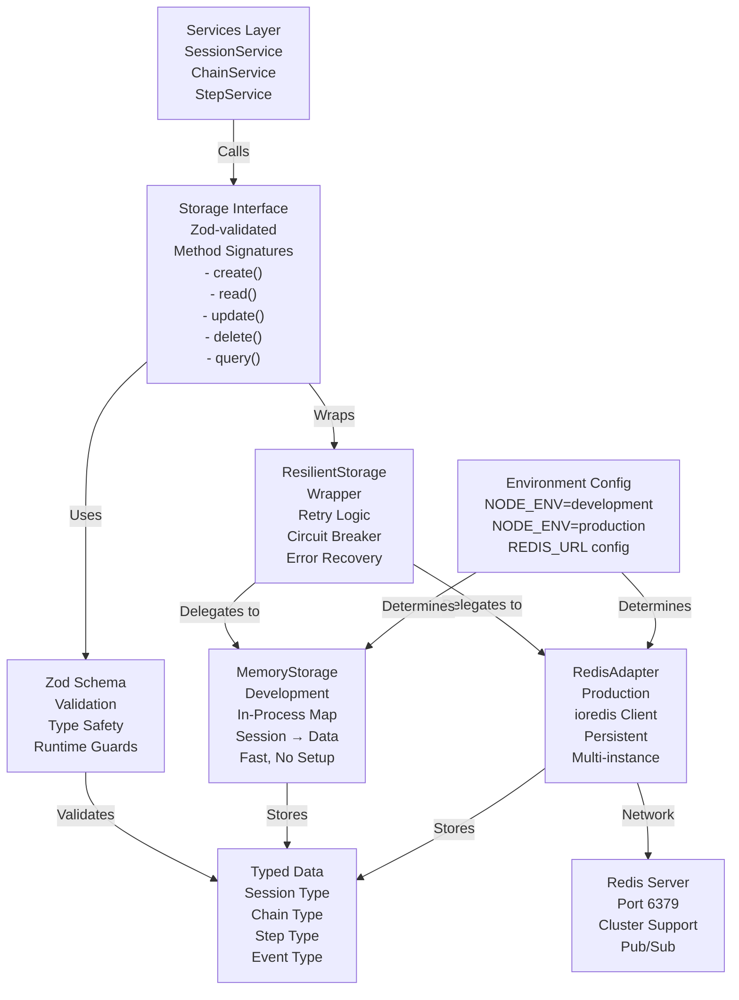

# Storage Layer Architecture

This diagram shows the pluggable storage system that powers the ActionFlows Dashboard backend.



## Storage Architecture Layers

### 1. Services Layer
- **SessionService** — Manages user sessions, authentication state
- **ChainService** — CRUD operations on action chains
- **StepService** — Handles individual step execution
- All services call the Storage Interface without knowing implementation

### 2. Storage Interface
The abstract interface that all implementations must provide:

```typescript
interface IStorage {
  // Session operations
  createSession(userId: UserId, data: SessionData): Promise<Session>;
  getSession(sessionId: SessionId): Promise<Session | null>;
  updateSession(sessionId: SessionId, updates: Partial<Session>): Promise<Session>;
  deleteSession(sessionId: SessionId): Promise<void>;
  listSessions(userId: UserId): Promise<Session[]>;

  // Chain operations
  createChain(sessionId: SessionId, data: ChainData): Promise<Chain>;
  getChain(chainId: ChainId): Promise<Chain | null>;
  updateChain(chainId: ChainId, updates: Partial<Chain>): Promise<Chain>;
  deleteChain(chainId: ChainId): Promise<void>;
  listChains(sessionId: SessionId): Promise<Chain[]>;

  // Step operations
  createStep(chainId: ChainId, data: StepData): Promise<Step>;
  getStep(stepId: StepId): Promise<Step | null>;
  updateStep(stepId: StepId, updates: Partial<Step>): Promise<Step>;
  deleteStep(stepId: StepId): Promise<void>;
  listSteps(chainId: ChainId): Promise<Step[]>;
}
```

### 3. Zod Validation Layer
**Runtime type safety** using Zod schemas:

```typescript
const SessionSchema = z.object({
  sessionId: SessionIdSchema,
  userId: UserIdSchema,
  createdAt: z.date(),
  updatedAt: z.date(),
  state: z.enum(['active', 'paused', 'completed']),
  // ... more fields
});

// All data validates before storage
const validated = SessionSchema.parse(incomingData);
```

**Benefits:**
- Catches schema violations at runtime
- Clear error messages for invalid data
- Type guards for TypeScript compiler
- No silent failures

### 4. ResilientStorage Wrapper
**Error handling and recovery layer**:

```typescript
class ResilientStorage implements IStorage {
  constructor(private delegate: IStorage) {}

  async createSession(userId: UserId, data: SessionData): Promise<Session> {
    try {
      return await this.delegate.createSession(userId, data);
    } catch (error) {
      // Retry logic
      // Circuit breaker
      // Fallback storage
      // Error logging
    }
  }
}
```

**Features:**
- **Retry Logic** — Automatic retries with exponential backoff
- **Circuit Breaker** — Prevent cascading failures
- **Fallback** — Switch to Memory if Redis fails
- **Error Logging** — Track storage failures for debugging

### 5. MemoryStorage Implementation
**Development storage** - in-process data structures:

```typescript
class MemoryStorage implements IStorage {
  private sessions = new Map<SessionId, Session>();
  private chains = new Map<ChainId, Chain>();
  private steps = new Map<StepId, Step>();

  async createSession(userId: UserId, data: SessionData): Promise<Session> {
    const session = { sessionId: newId(), ...data };
    this.sessions.set(session.sessionId, session);
    return session;
  }
}
```

**Characteristics:**
- ✅ No external dependencies
- ✅ Fast (in-memory access)
- ✅ Perfect for development/testing
- ❌ Data lost on server restart
- ❌ Single-instance only (no multi-process sync)

### 6. RedisAdapter Implementation
**Production storage** - distributed cache with persistence:

```typescript
class RedisAdapter implements IStorage {
  constructor(private redis: Redis) {}

  async createSession(userId: UserId, data: SessionData): Promise<Session> {
    const session = { sessionId: newId(), ...data };
    await this.redis.set(
      `session:${session.sessionId}`,
      JSON.stringify(session),
      'EX',
      86400 // 24 hour TTL
    );
    return session;
  }

  async listSessions(userId: UserId): Promise<Session[]> {
    const keys = await this.redis.keys(`session:*`);
    const sessions = await Promise.all(
      keys.map(k => this.redis.get(k))
    );
    return sessions.map(s => JSON.parse(s));
  }
}
```

**Characteristics:**
- ✅ Persistent data
- ✅ Multi-instance synchronization (shared Redis)
- ✅ Horizontal scaling
- ✅ Built-in TTL/expiration
- ✅ Pub/Sub for real-time updates
- ⚠️ Requires Redis server setup

## Storage Selection Logic

### Development Mode
```
NODE_ENV === 'development'
  → Use MemoryStorage
  → No external setup needed
  → Fast iteration
```

### Production Mode
```
NODE_ENV === 'production'
  && REDIS_URL defined
  → Use RedisAdapter
  → Wrapped in ResilientStorage
  → Multi-instance support
  → Persistent data
```

### Fallback Strategy
```
Redis Connection Fails
  → ResilientStorage catches error
  → Circuit breaker opens
  → Fall back to MemoryStorage
  → Log error for monitoring
  → Continue operation (degraded)
```

## Data Persistence Patterns

### Session Lifecycle
```
Create Session → Store in Redis with TTL 24h
               → Update on every activity
               → Clean up on logout
               → Or expire after 24h inactivity
```

### Chain State Tracking
```
Create Chain → Persist to Redis
            → Update status as steps progress
            → Store step execution order
            → Archive on completion
```

### Event Log
```
Append-Only Log → Each action creates event
                → Stored in Redis list/stream
                → Available for audit/replay
                → Pruned periodically
```
