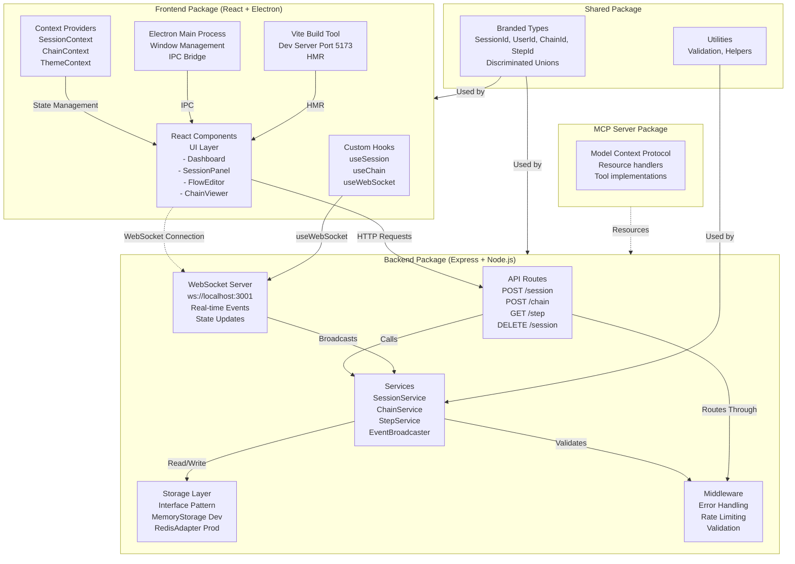

# System Architecture

This diagram shows the 4-package monorepo structure and how components interact across the ActionFlows Dashboard system.

## Architecture Overview

### 4-Package Monorepo (pnpm workspaces)

**packages/shared/**
- Single source of truth for types
- Branded string types (SessionId, UserId, etc.) for compile-time safety
- Discriminated unions for type-safe state handling
- No dependencies on other packages

**packages/backend/**
- Express 4.18 API server (port 3001)
- WebSocket server for real-time updates
- Storage abstraction layer (pluggable: Memory/Redis)
- Business logic services (SessionService, ChainService, StepService)
- Zod schemas for request validation

**packages/app/**
- React 18.2 UI components
- Electron 28 desktop wrapper
- Vite 5 development server with HMR
- Custom hooks for state management
- React Context for app-level state

**packages/mcp-server/**
- Model Context Protocol 1.0 implementation
- Resource handlers for Claude integration
- Tool implementations for automation

### Data Flow Patterns

1. **User Action → Frontend** — User interacts with React component
2. **Frontend → Backend API** — HTTP POST to Express route
3. **Backend Processing** — Services validate and process request
4. **Storage Operation** — Services persist to Memory/Redis
5. **WebSocket Broadcast** — Services emit events to connected clients
6. **State Update → UI Render** — React updates component state
7. **WebSocket Listener** — Other clients receive real-time updates

### Key Integration Points

- **Shared Types Bridge** — All packages import from shared/ for type safety
- **HTTP API** — Standard REST endpoints for CRUD operations
- **WebSocket Events** — Real-time state synchronization across clients
- **Storage Interface** — Abstraction allows Memory (dev) or Redis (prod) without code changes
- **Electron IPC** — Desktop app communicates with React layer
