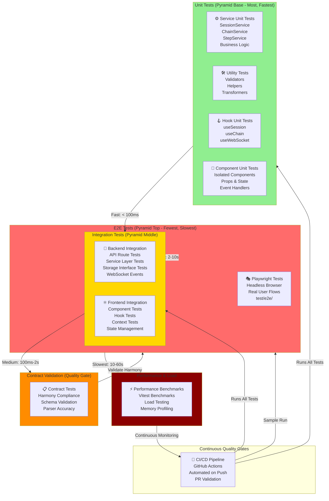

# Testing Pyramid Architecture

This diagram shows the testing strategy and layers that ensure code quality and reliability in the ActionFlows Dashboard.



## Testing Strategy Overview

### Layer 1: Unit Tests (Base - Fast & Plentiful)

**Purpose:** Test individual functions, hooks, and components in isolation

**Location:**
- Backend: `packages/backend/src/__tests__/`
- Frontend: `packages/app/src/__tests__/`

**Examples:**

```typescript
// Service unit test
describe('SessionService', () => {
  it('should create a new session with valid user', async () => {
    const session = await sessionService.createSession(userId, { name: 'Test' });
    expect(session.userId).toBe(userId);
    expect(session.state).toBe('active');
  });
});

// Hook unit test
describe('useSession hook', () => {
  it('should fetch session on mount', () => {
    const { result } = renderHook(() => useSession(sessionId));
    expect(result.current.loading).toBe(true);
  });
});

// Component unit test
describe('SessionPanel', () => {
  it('should render session title', () => {
    const { getByText } = render(<SessionPanel session={mockSession} />);
    expect(getByText('Test Session')).toBeInTheDocument();
  });
});
```

**Test Framework:** Vitest
**Speed:** < 100ms per test
**Count:** 50-100+ tests

### Layer 2: Integration Tests (Middle - Medium Speed)

**Purpose:** Test how components, services, and storage work together

**Categories:**

#### Backend Integration
```typescript
// API route integration test
describe('POST /api/session', () => {
  it('should create session and broadcast event', async () => {
    const response = await request(app)
      .post('/api/session')
      .send({ userId, name: 'Test' });

    expect(response.status).toBe(201);
    expect(response.body.sessionId).toBeDefined();

    // Verify storage was called
    const stored = await storage.getSession(response.body.sessionId);
    expect(stored).toBeDefined();

    // Verify WebSocket broadcast
    expect(mockWS.emit).toHaveBeenCalledWith('session:created', expect.any(Object));
  });
});

// Service with storage integration
describe('ChainService with storage', () => {
  it('should persist chain across requests', async () => {
    const chain = await chainService.createChain(sessionId, chainData);
    const retrieved = await storage.getChain(chain.chainId);
    expect(retrieved).toEqual(chain);
  });
});
```

#### Frontend Integration
```typescript
// Component with hooks integration
describe('SessionPanel with hooks', () => {
  it('should update when session state changes', async () => {
    const { rerender } = render(<SessionPanel sessionId={sessionId} />);
    await waitFor(() => expect(mockUseSession).toHaveBeenCalled());

    // Simulate session update
    act(() => {
      sessionContextValue.state = 'paused';
    });

    rerender(<SessionPanel sessionId={sessionId} />);
    expect(getByText('Paused')).toBeInTheDocument();
  });
});
```

**Speed:** 100ms - 2s per test
**Count:** 20-50 tests
**Framework:** Vitest + Testing Library

### Layer 3: Contract Validation (Quality Gate)

**Purpose:** Ensure all outputs conform to contract specifications and harmony standards

**Focus Areas:**

```typescript
// Contract validation test
describe('SessionCreated event harmony', () => {
  it('should match SESSION_CREATED_EVENT schema', async () => {
    const event = await sessionService.createSession(userId, data);

    // Parse event through contract parser
    const parsed = SessionCreatedEventSchema.parse(event);

    // Verify harmony compliance
    expect(parsed.sessionId).toBeDefined();
    expect(parsed.timestamp).toBeInstanceOf(Date);
    expect(parsed.userId).toBeDefined();
  });
});

// Parser accuracy test
describe('EventParser harmony compliance', () => {
  it('should reject malformed events', () => {
    const invalid = { sessionId: 'INVALID' };
    expect(() => SessionCreatedEventSchema.parse(invalid)).toThrow();
  });
});
```

**Purpose:** Prevent harmony drift between frontend and backend
**Speed:** < 500ms per test
**Tool:** `pnpm run harmony:check`

### Layer 4: E2E Tests (Top - Few but Comprehensive)

**Purpose:** Test real user workflows end-to-end using a real or headless browser

**Test Scenarios:**

```typescript
// Full session lifecycle
describe('Session Lifecycle E2E', () => {
  it('user can create, execute, and complete a chain', async () => {
    // 1. Navigate to dashboard
    await page.goto('http://localhost:5173');

    // 2. Create new session
    await page.click('button[aria-label="New Session"]');
    await page.fill('input[name="session-name"]', 'E2E Test');
    await page.click('button:has-text("Create")');

    // 3. Wait for session panel
    await page.waitForSelector('[data-testid="session-panel"]');
    const sessionId = await page.getAttribute('[data-testid="session-id"]', 'data-value');

    // 4. Create chain
    await page.click('button[aria-label="Add Chain"]');
    // ... continue interactions

    // 5. Verify final state
    expect(await page.textContent('[data-testid="status"]')).toContain('completed');
  });
});

// WebSocket real-time collaboration
describe('Real-time Collaboration E2E', () => {
  it('two users see updates in real-time', async () => {
    // Open two browser contexts
    const context1 = await browser.newContext();
    const context2 = await browser.newContext();

    const page1 = await context1.newPage();
    const page2 = await context2.newPage();

    // Both load same session
    await page1.goto(`http://localhost:5173?session=${sessionId}`);
    await page2.goto(`http://localhost:5173?session=${sessionId}`);

    // User 1 creates chain
    await page1.click('button[aria-label="Add Chain"]');

    // User 2 should see it appear
    await page2.waitForSelector('[data-chain-id]');
    expect(await page2.getAttribute('[data-chain-id]', 'data-value')).toBeDefined();
  });
});
```

**Framework:** Playwright (headless browser automation)
**Location:** `test/e2e/`
**Speed:** 10-60s per test
**Count:** 5-15 critical user flows

### Layer 5: Performance & Load Testing

**Purpose:** Ensure system scales and maintains acceptable performance

**Benchmarks:**

```typescript
// Performance benchmark
describe('Session creation performance', () => {
  it('should create 1000 sessions in < 5 seconds', async () => {
    const start = performance.now();

    for (let i = 0; i < 1000; i++) {
      await sessionService.createSession(userId, { name: `Session ${i}` });
    }

    const elapsed = performance.now() - start;
    expect(elapsed).toBeLessThan(5000);
  });
});

// Memory profiling
describe('Memory efficiency', () => {
  it('should not leak memory after 100 operations', async () => {
    const initialMemory = process.memoryUsage().heapUsed;

    for (let i = 0; i < 100; i++) {
      await chainService.createChain(sessionId, chainData);
      await chainService.deleteChain(chainId);
    }

    // Force garbage collection
    gc();

    const finalMemory = process.memoryUsage().heapUsed;
    expect(finalMemory - initialMemory).toBeLessThan(1000000); // 1MB threshold
  });
});
```

**Tool:** Vitest benchmarks
**Continuous:** Run on every deploy
**Alert:** Notify if 10%+ regression detected

## Test Execution Strategy

### Development (Local)
```bash
# Run all unit tests
pnpm test

# Run specific test file
pnpm test SessionService

# Run tests in watch mode
pnpm test --watch

# Run with coverage
pnpm test --coverage
```

### CI/CD Pipeline
```bash
# 1. Type check (fastest)
pnpm type-check

# 2. Lint (fast)
pnpm lint

# 3. Unit tests (fast)
pnpm test

# 4. Contract validation
pnpm run harmony:check

# 5. Integration tests (medium)
pnpm test:integration

# 6. Sample E2E tests (slow)
pnpm test:e2e --sample

# 7. Performance benchmarks
pnpm bench
```

### PR Gate Strategy
- Must pass: Type check + Lint + Unit tests + Contract validation
- Should pass: Integration tests
- Optional: Full E2E suite (run nightly instead)
- Always fail on: Harmony violations

## Coverage Goals

| Layer | Min Coverage | Target |
|-------|--------------|--------|
| Unit Tests | 80% | 90%+ |
| Integration | 70% | 85%+ |
| E2E Flows | 5 critical | 10+ flows |
| Contract | 100% | All formats |

## Failure Remediation

### Test Failure Protocol
1. **Unit Test Fails** → Developer fixes immediately (blocks commit)
2. **Integration Fails** → Review cross-layer dependencies
3. **Contract Fails** → Sync harmony spec with implementation
4. **E2E Fails** → Check environment/browser setup first
5. **Performance Regresses** → Profile and optimize
